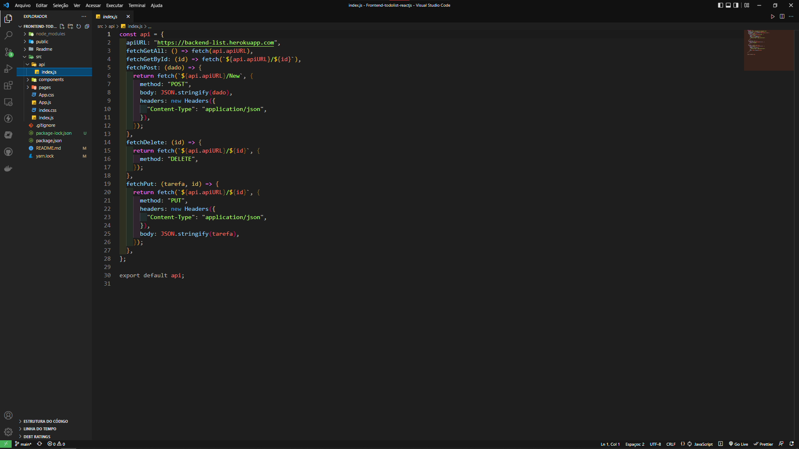
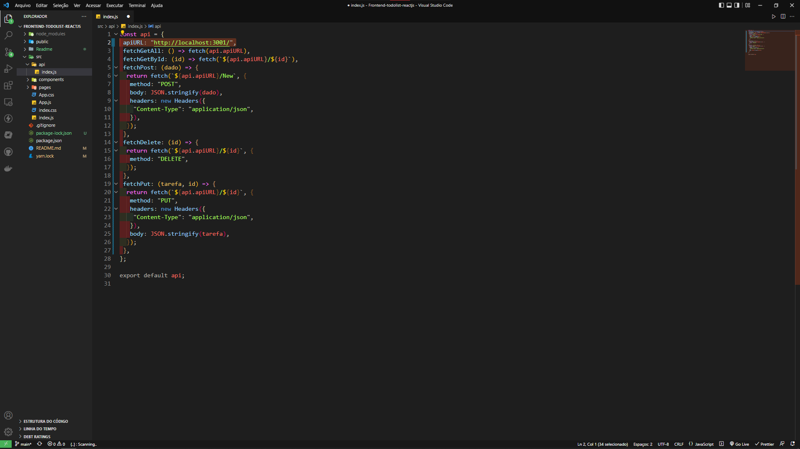

<h1 align="center"> ⚡ Front-end Todolist ⚡</h1>


<div align="center">  
 
</div>

## Teste você mesmo o projeto

### Front-end:  <https://frontend-list.herokuapp.com/>

### Back-end: <https://backend-list.herokuapp.com/>

## Pré requisistos 📝

### Para iniciar o projeto você precisa do <a href="https://nodejs.org/en/download/">Node js</a>, <a href="https://create-react-app.dev/docs/getting-started/">ReactJs</a>, <a href="https://git-scm.com/downloads">Git</a>, e do <a href="https://www.mongodb.com/try/download/community">MongoDBCompass</a> instalados e para starta o projeto você vai precisar de uma <a href="https://code.visualstudio.com/download">IDE</a>


## Rodando o Back-end 🎲

```bash
#Clone do repositorio
$ git clone <https://github.com/rafaelmasselli/BackEnd-Todolist>

#Acesse a pasta do projeto pelo terminal
$ cd <Nome da pastas>

#instale as depedências
$ npm install

#Inicie o projeto em modo de desenvolvedor
$ npm run start dev


```

> Mais informações do back end na documentação do projeto <https://github.com/rafaelmasselli/BackEnd-Todolist-NodeJs>

## Rodando o Front-end 🎲

``` bash
# Clonando o projeto
$ git clone https://github.com/rafaelmasselli/FrontEnd-Todolist-ReactJs

# Entrando na pasta do projeto com o terminal ou com a IDE
> cd <FrontEnd-Todolist-Reactjs>

# Instalando o projeto 
$ npm install 

# Com o Back-end rodando inicie o projeto 
$ npm start

```

> Mudando a url do fetch Back-end ( Opcional )

> Ja dentro do projeto com uma IDE entre na pasta src/api



> Na const api altere o valor do "apiURL" para <http://localhost:3001/>




## Descrição 🐱‍👤

### Projeto Todolist Bloco de notas feito para anotar as atividades do usúario.

- [x] Consumo de Rest api com axios
- [x] Visualizar todas as terefas. Get
- [x] Visualizar uma unica tarefa. Get
- [x] Criar Tarefa. Post
- [x] Editar Tarefa. patch

## Ferramentas usadas no projeto 

- [x] React Js
- [x] React router dom
- [x] Boostrap
- [x] React modal
